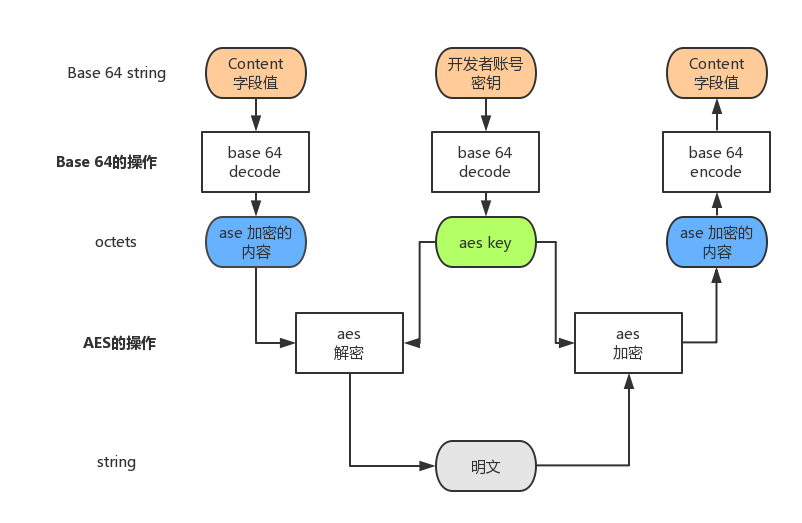

接入指南
========================================

消息加解密与安全
------------------

安全体系
^^^^^^^^^^^^^

美味开放平台采用了如下方式对数据进行了安全处理，具体如下：

开发者申请得到的appKey，经过SHA-1 128位摘要算法后取前128位生成摘要签名sign（sign应经过Base64转码成字符串），(sign+token)继续经过SHA-1 128位摘要算法后取前128位生成真正的AES加密秘钥 key S2（S2应经过Base64转码成字符串），开发者在发给美味的数据中应包括sign、unix时间戳ts（秒），且整体数据经过S2的AES加密。美味侧，首先会进行解密， 获取sign和ts，并且验证sign是否能生成S2且ts是否在10min中内，以此来判断该请求是否有效。

美味推送给开发者的信息也经过S2加密，但是无sign和ts；开发者在response的时候应该参照上述的方式进行。

加解密算法
^^^^^^^^^^^^^

美味开放平台采用AES对称加密算法对推送给开发者的消息体进行加密，加解密所用的密钥是S2。 开发者用此密钥对收到的密文消息体进行解密，回复消息体也用此密钥加密，且应带上sign和ts。

加解密使用对称密码的AES规范，加密后的结果采用Base 64进行表示，密钥本身也使用Base 64的表示，涉及中文等字符使用utf-8字符集。

美味开放平台可以接受第63和第64个字符为+/的Base 64和url-safe的-_的Base 64，给出的密文将使用url-safe的-_的Base 64。

Base 64的内容放入content字段进行传输，收到content字段时，可将字段内容用Base64解析，将解析结果按照AES规范和对应的密钥（S2）进行解密。

加解密实现机制
^^^^^^^^^^^^^^^^^

图例形象化说明了解密和加密的过程。开发者密钥和content字段值是Base 64表示的字符串，经过解码后，对应的结果为两个八位数组。

八位数组中一个是aes key，另一个是aes加密的内容。依循AES规范，用aes key解密aes的加密内容得到对应的明文。

加密的时候，将明文当作八位数组，依循AES规范，用aes key加密得到aes的加密内容，然后将aes的加密内容用Base 64表示为字符串得到对应的密文。

示例代码(Java)

.. literalinclude:: _code/demo.java
   :language: java
   :linenos:
                    
示例代码(.Net)

.. literalinclude:: _code/demo.cs
   :language: csharp
   :linenos:

                    
示例代码(php)

.. literalinclude:: _code/demo.php
   :language: javascript
   :linenos:

                    
示例代码(nodejs)

.. literalinclude:: _code/nodejs_demo.js
   :language: javascript
   :linenos:

发送/接收消息
------------------

发送/接收消息请求说明
^^^^^^^^^^^^^^^^^^^^^^^^^^

开发者向点评发送消息或者点评向开发者推送消息均采用以下参数及返回形式

HTTP请求方式：POST (form-data)

返回数据格式：JSON
                
参数说明
^^^^^^^^^^^^^^^^^^^^^^^^^^

========== =========== =======================================================================================
参数        类型         描述
========== =========== =======================================================================================
token*     String       点评提供给您的开发者token
content*   jsonString   S2加密后的业务数据，格式见content说明
version    String       用于标识调用的点评业务方服务的版本，默认是v1.0.0版本，此版本号由点评提供，和调用的业务相关
========== =========== =======================================================================================

content说明
^^^^^^^^^^^^^^^^^^^^^^^^^^

========== =========== =======================================================================================
参数        类型         描述
========== =========== =======================================================================================
content*    String      业务数据
sign*       String      appKey经过SHA1摘要加密且经过base64转码生成
ts*         long        unix时间戳（秒）
========== =========== =======================================================================================

返回结果说明
^^^^^^^^^^^^^^^^^^^^^^^^^^

========== =========== =======================================================================================
字段        类型         描述
========== =========== =======================================================================================
code        int        返回码 200成功，非200失败 参见
msg         string     返回消息
content     string     加密后的业务返回数据
id          long       请求id
properties  json       附加信息map转换成的json
========== =========== =======================================================================================

返回码和问题诊断
------------------

接入上线步骤说明
------------------